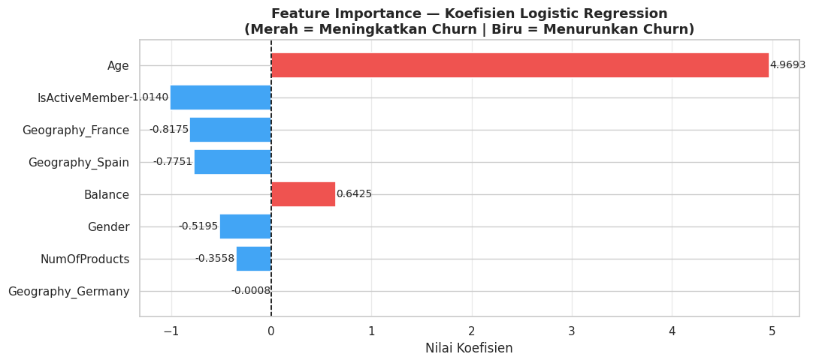

<div align="center">
  
# Bank Customer Churn Prediction


*A comprehensive Data Mining and Machine Learning pipeline to predict customer churn, documented in an academic IEEE format.*

</div>

<br />

## Table of Contents
- [Project Overview](#project-overview)
- [Repository Structure](#repository-structure)
- [Methodology](#methodology)
- [Key Results](#key-results)
- [How to Run](#how-to-run)
- [Contributing](#contributing)
- [License](#license)

---

## Project Overview

This repository contains a comprehensive **Data Mining and Machine Learning** project focused on predicting bank customer churn. We implemented a complete data pipeline—from Exploratory Data Analysis (EDA) and Preprocessing to Feature Selection (Chi-Square vs PCA) and Model Evaluation.

The project is documented thoroughly, making it ideal for academic or portfolio showcases. 

**Objective:** 
To accurately predict whether a bank customer will close their account (churn) using **Logistic Regression** and **Decision Tree** algorithms, and to compare the effectiveness of **Chi-Square** feature selection versus **PCA** dimensionality reduction.

---

## Repository Structure

```text
bank-customer-churn-prediction/
 ┣ dataset                     # Directory containing the churn dataset
 ┣ images                      # Visualizations and plots generated from the notebook
 ┣ Customer_Churn.ipynb        # Main Jupyter Notebook containing all code & analysis
 ┣ requirements.txt            # Python dependencies
 ┣ .gitignore                  # Git ignore file
 ┗ README.md                   # Project documentation
```

---

## Methodology

### 1. Data Preprocessing & EDA
- **Class Imbalance:** Addressed a moderate class imbalance (79.6% non-churn vs 20.4% churn).
- **Encoding:** Applied Label Encoding for binary categories and One-Hot Encoding for multi-class categories.
- **Analysis:** Conducted extensive Exploratory Data Analysis (EDA), analyzing the impact of Age, Balance, and Geography on churn rates.

### 2. Feature Engineering
We explored two different approaches to handle features:
- **Chi-Square Feature Selection:** Selected 8 statistically significant features (Gender, Age, Balance, NumOfProducts, IsActiveMember, Geography_France, Geography_Germany, Geography_Spain).
- **PCA (Principal Component Analysis):** Reduced features into 10 Principal Components that explain >90% of the variance.

### 3. Modeling
We evaluated three different configurations to find the optimal predictive model:
1. `Logistic Regression (Chi-Square)`
2. `Decision Tree (Chi-Square)`
3. `Logistic Regression (PCA)`

---

## Key Results

The **Decision Tree** model using 8 Chi-Square selected features significantly outperformed Logistic Regression, especially in detecting the minority churn class.

| Model | Accuracy | Precision | Recall | F1-Score |
|-------|:--------:|:---------:|:------:|:--------:|
| LR (Chi-Square) | 80.95% | 60.66% | 18.18% | 27.98% |
| **DT (Chi-Square)** | **85.70%** | **78.95%** | **40.54%** | **53.57%** |
| LR (PCA) | 80.85% | 59.23% | 18.92% | 28.68% |

> **Insight:** The Decision Tree model successfully identified a much higher proportion of actual churners compared to the baseline Logistic Regression model.

### Confusion Matrix (Decision Tree)

<div align="center">
  
</div>

---

## How to Run

Follow these steps to replicate the environment and run the project locally:

1. **Clone the repository:**
   ```bash
   git clone https://github.com/kebabresing/bank-customer-churn-prediction.git
   cd bank-customer-churn-prediction
   ```

2. **Install dependencies:**
   ```bash
   pip install -r requirements.txt
   ```

3. **Run the Jupyter Notebook:**
   ```bash
   jupyter notebook Customer_Churn.ipynb
   ```
> **Note:** The dataset (`churn.csv`) is located inside the `dataset/` directory. If it's not present, you can download it from [Kaggle](https://www.kaggle.com/datasets/mathchi/churn-for-bank-customers) and place it there before running.

---

## Contributing
Contributions, issues, and feature requests are welcome! Feel free to check the [issues page](https://github.com/kebabresing/bank-customer-churn-prediction/issues).

## License
This project is licensed under the **MIT License**.